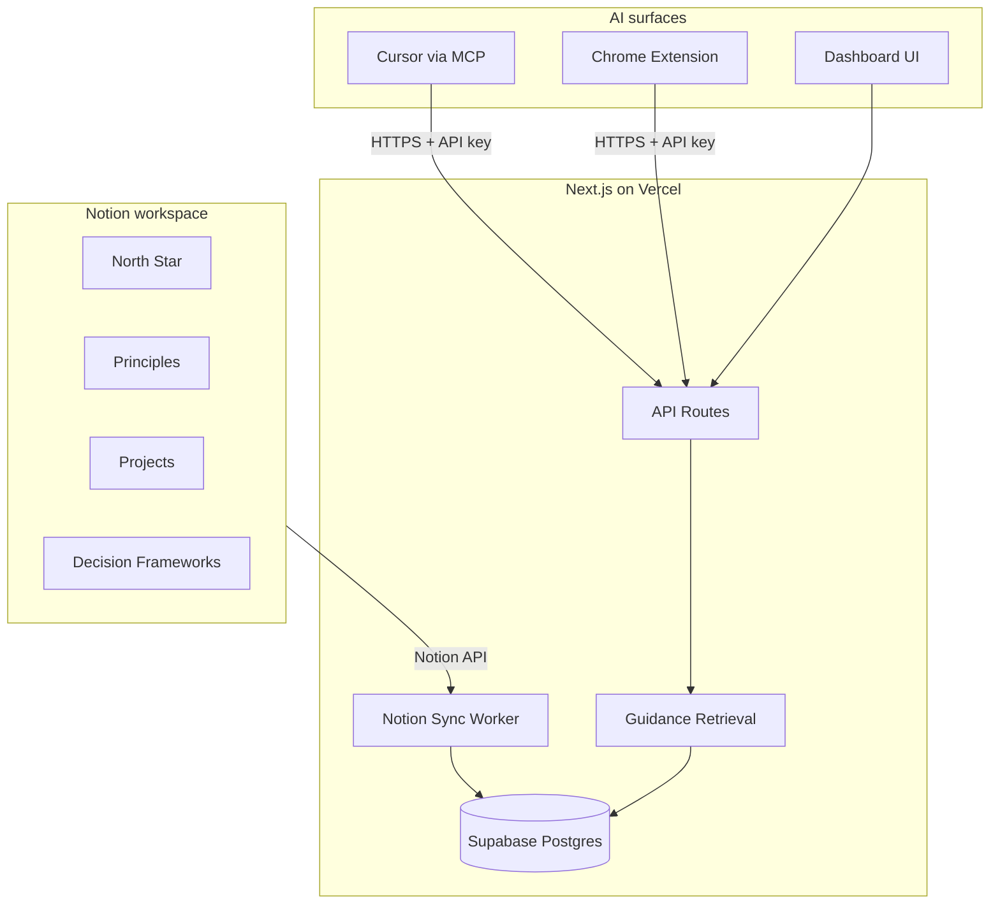

# Architecture — Guidance Layer

Personal decision guidance system: **Notion as editor**, **Next.js on Vercel as sync + retrieval hub**, **MCP + Chrome extension as injection surfaces**.

## System overview



## Components

### 1. Next.js web app (Vercel)

| Route | Purpose |
|-------|---------|
| `/` | Dashboard — decision modes, sync status, last sync time |
| `/api/guidance` | Assemble context bundle for a mode (+ optional query) |
| `/api/notion/sync` | Pull Notion → Postgres, chunk, embed (embeddings Phase 1.5) |
| `/api/auth` | Placeholder for API key / session auth |

**Why Vercel:** zero-ops deploy, cron for scheduled sync, edge-friendly API routes.

### 2. Supabase Postgres + pgvector

| Table | Role |
|-------|------|
| `users` | Account identity (auth provider TBD) |
| `api_tokens` | Bearer tokens for MCP + extension |
| `notion_connections` | Integration token + mapped database IDs |
| `guidance_documents` | Normalized Notion pages |
| `guidance_chunks` | Split content for retrieval |
| `chunk_embeddings` | Vector index (jsonb in Phase 1; pgvector column in 1.5) |
| `sync_jobs` | Audit trail for sync runs |

**Phase 1 retrieval:** keyword + metadata ranking (type, mode, priority, starred).  
**Phase 1.5:** OpenAI `text-embedding-3-small` → pgvector cosine search.

Enable pgvector on Supabase:

```sql
CREATE EXTENSION IF NOT EXISTS vector;
```

### 3. Notion sync pipeline

```
1. Cron or manual POST /api/notion/sync
2. For each configured database ID:
   a. Query pages (filter Status != Archived)
   b. Fetch block children → markdown
   c. Map properties → guidance_documents row
   d. Upsert by notion_page_id
3. Chunk document content (~500 tokens)
4. (Optional) Embed new/changed chunks
5. Record sync_jobs row
```

OAuth vs integration token: **Phase 1 uses Notion internal integration token** (simplest). OAuth for multi-user SaaS is Phase 2.

### 4. Guidance retrieval

`getGuidanceContext(mode, userId, options)`:

1. Load mode config (which document types, max docs, token budget)
2. Query documents: starred first, then priority, then type filter
3. Attach matching decision frameworks for the mode
4. Format as markdown bundle with source citations (Notion page title + id)
5. Return `{ context, sources, tokenEstimate }`

Used by API, MCP tool, and extension.

### 5. MCP server (Cursor)

Location: `mcp/server.ts` — runs locally via `npm run mcp`.

Tools exposed:

| Tool | Description |
|------|-------------|
| `get_guidance` | `mode`: career \| project \| motivation; optional `query` |
| `search_guidance` | Full-text search across synced docs |

Connect in Cursor → MCP settings:

```json
{
  "mcpServers": {
    "guidance-layer": {
      "command": "npm",
      "args": ["run", "mcp"],
      "cwd": "C:/Myfiles/git/memory",
      "env": {
        "GUIDANCE_API_URL": "https://your-app.vercel.app",
        "GUIDANCE_API_KEY": "your-token"
      }
    }
  }
}
```

### 6. Chrome extension (Phase 2 plan)

Not built in Phase 1 — architecture only.

```
User on chatgpt.com / claude.ai
  → clicks extension icon
  → selects mode (career / project / motivation)
  → extension GET /api/guidance?mode=career
  → injects markdown into chat textarea (Unibase-style)
```

**Manifest V3** service worker calls your Vercel API with stored API key.  
Content scripts for: `chatgpt.com`, `claude.ai`, `gemini.google.com`.

Shared logic with MCP: same `/api/guidance` response shape.

## Security

- Notion token stored encrypted at rest (Phase 2); env var for Phase 1 single-user
- API keys hashed in `api_tokens`; plain key shown once on create
- All guidance endpoints require `Authorization: Bearer <token>`
- CORS locked to extension origin + dashboard domain

## Environment variables

See `.env.example`. Minimum for local dev:

- `SUPABASE_URL` — Supabase project URL`r`n- `SUPABASE_SERVICE_ROLE_KEY` — server-only Supabase service role key
- `NOTION_API_KEY` — integration secret
- `NOTION_DATABASE_*` — four database IDs
- `GUIDANCE_API_KEY` — for MCP/extension (or generate via `/api/auth`)

## Deployment (Vercel)

1. Push repo to GitHub
2. Import in Vercel, set env vars
3. Add Vercel Cron (optional): `0 */6 * * *` → `/api/notion/sync`

## Phase roadmap

| Phase | Scope |
|-------|--------|
| **1 (now)** | Schema, sync stub, metadata retrieval, MCP, dashboard |
| **1.5** | Embeddings + pgvector semantic search |
| **2** | Auth (Clerk/NextAuth), encrypted Notion tokens, Chrome extension |
| **3** | Proactive nudges, "stale doc" reminders, decision journaling |

## Tech stack

- **Runtime:** Node 22, TypeScript
- **Framework:** Next.js 16 App Router
- **ORM:** Drizzle + `postgres.js`
- **Validation:** Zod
- **Notion:** `@notionhq/client`
- **MCP:** `@modelcontextprotocol/sdk`
- **Embeddings (1.5):** OpenAI via `openai` package
